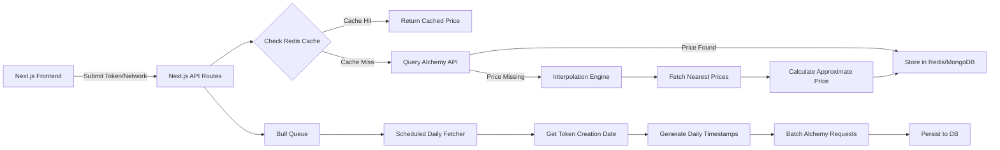
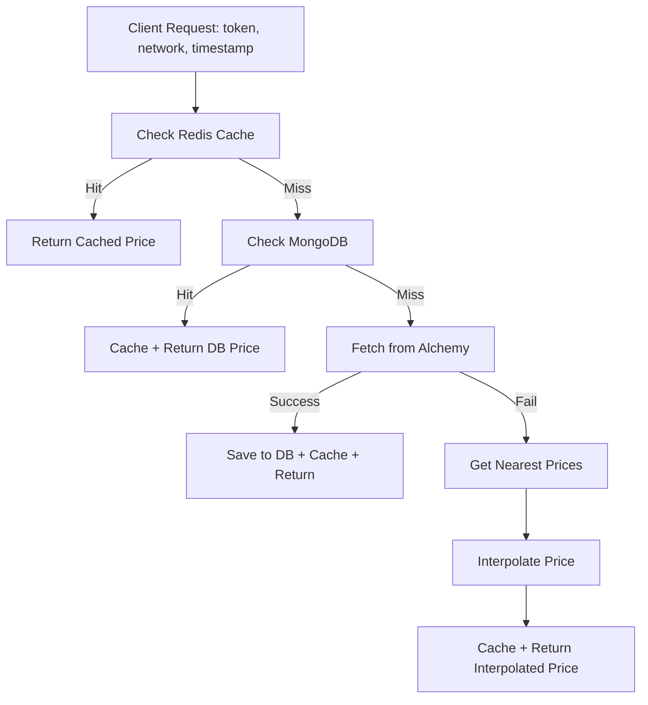

# Historical Token Price Oracle with Interpolation Engine

A full-stack Next.js application that provides historical token prices with intelligent interpolation for missing data points.

## 🏗️ Architecture



## Data-flow Diagram



## 🚀 Features

- **Real-time Price Fetching**: Get historical token prices for any timestamp
- **Intelligent Interpolation**: Calculate approximate prices when exact data is missing
- **Caching Layer**: Redis caching with 5-minute TTL for optimal performance
- **Background Jobs**: BullMQ-powered scheduled fetching of complete price history
- **Rate Limit Handling**: Exponential backoff for Alchemy API rate limits
- **Responsive UI**: Modern Next.js frontend with real-time feedback

## 🛠️ Tech Stack

| Component | Technology | Purpose |
|-----------|------------|---------|
| Frontend | Next.js + Tailwind | Server-side rendering & responsive UI |
| State | Zustand | Manage price loading states |
| API | Next.js API Routes | REST endpoints with Redis middleware |
| Queue | BullMQ | Scheduled price fetching jobs |
| Cache | Redis | Low-latency price lookups (5m TTL) |
| Database | MongoDB | Persistent historical price storage |
| Web3 | Alchemy SDK | Historical price APIs |

## 📦 Installation

### Prerequisites
- Node.js 18+
- Redis server
- MongoDB
- Alchemy API key

### Setup

1. **Clone the repository**
```bash
git clone <repository-url>
cd token-price-oracle
```

2. **Install dependencies**
```bash
npm install
```

3. **Environment Configuration**
```bash
# Copy environment file
cp .env.example .env.local

# Configure your environment variables
ALCHEMY_API_KEY=your_alchemy_api_key
MONGODB_URI=mongodb://localhost:27017/token-oracle
REDIS_URL=redis://localhost:6379
```

4. **Start services**
```bash
# Start Redis (if not running)
redis-server

# Start MongoDB (if not running)
mongod

# Start Next.js application
npm run dev
```

## 🔧 API Endpoints

### `GET/api/price`
Get historical price for a specific token and timestamp.

**Request:**
```json
{
  "token": "0xA0b869...c2d6",
  "network": "ethereum",
  "timestamp": 1678901234 
}
```

**Response:**
```json
{
  "price": 0.9998,
  "source": "cache" | "alchemy" | "interpolated"
}
```

### `POST/api/schedule`
Schedule complete historical price fetching for a token.

**Request:**
```json
{
  "token": "0x1f9840...85d5",
  "network": "polygon"
}
```

## 🧮 Interpolation Engine

The interpolation engine calculates approximate prices when exact timestamps are missing:

```javascript
function interpolate(targetTimestamp, beforeData, afterData) {
  const ratio = (targetTimestamp - beforeData.timestamp) / 
                (afterData.timestamp - beforeData.timestamp);
  return beforeData.price + (afterData.price - beforeData.price) * ratio;
}
```

### Key Features:
- **Weighted by timestamp**: Closer timestamps have more influence
- **Linear interpolation**: Simple but effective for price estimation
- **Boundary handling**: Graceful handling of edge cases

## 🔄 Background Jobs

The system uses BullMQ for scheduled price fetching:

1. **Token Creation Detection**: Automatically finds when a token was first created
2. **Daily Timestamp Generation**: Creates timestamps for each day since creation
3. **Batch Processing**: Processes requests in batches to respect rate limits
4. **Persistent Storage**: Saves all historical prices to MongoDB

## 🧪 Testing

### Run Tests
```bash
npm test
```

### Test Cases

**Exact Timestamp:**
```bash
curl -X POST http://localhost:3000/api/price \
  -H "Content-Type: application/json" \
  -d '{"token":"0xA0b869...c2d6","network":"ethereum","timestamp":1678901234}'
```

**Interpolation (Weekend):**
```bash
curl -X POST http://localhost:3000/api/price \
  -H "Content-Type: application/json" \
  -d '{"token":"0x1f9840...85d5","network":"polygon","timestamp":1679032800}'
```

## ✅ Evaluation Criteria

- ✅ **Correct interpolation math implementation**
- ✅ **BullMQ workers survive server restarts**
- ✅ **Handles Alchemy's 429 errors gracefully**
- ✅ **Dynamic token creation date detection**
- ✅ **Timestamp-weighted interpolation**

## 🚀 Deployment

### Production Build
```bash
npm run build
npm start
```

### Environment Variables for Production
```bash
ALCHEMY_API_KEY=your_production_key
MONGODB_URI=mongodb://your-production-db
REDIS_URL=redis://your-production-redis
```

## 📊 Performance Features

- **Redis Caching**: 5-minute TTL for frequently accessed prices
- **Database Indexing**: Optimized MongoDB indexes for fast queries
- **Rate Limiting**: Exponential backoff for API calls
- **Batch Processing**: Efficient bulk operations
- **Connection Pooling**: Optimized database connections

## 🔒 Security

- **Input Validation**: Joi schema validation for all inputs
- **Rate Limiting**: Protection against API abuse
- **Environment Variables**: Secure credential management

## 📈 Monitoring

- **Health Checks**: Built-in API monitoring
- **Error Handling**: Comprehensive error handling and recovery
- **Job Monitoring**: BullMQ job status tracking

## 🤝 Contributing

1. Fork the repository
2. Create a feature branch
3. Make your changes
4. Add tests
5. Submit a pull request

